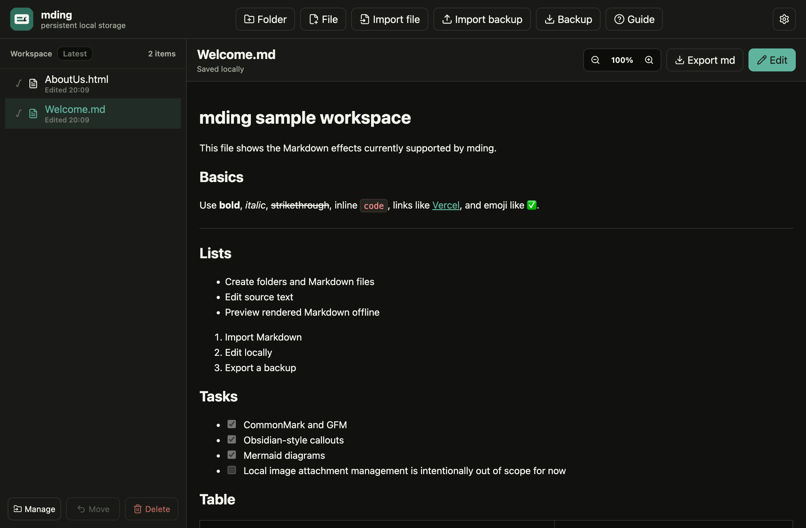

# mding

[English](README.md) | [한국어](README.ko.md)

mding은 개인용으로 가볍게 쓰기 위한 로컬 우선 Markdown 작업공간이며, 참고용 HTML 파일은 읽기 전용으로 미리볼 수 있습니다. 처음에는 iOS/macOS용 네이티브 Markdown 뷰어 겸 편집기로 생각했지만, 무료 사이드로드의 7일 제한과 TestFlight 배포 부담을 피하고 iPhone, iPad, Mac, Android에서 같은 앱을 쓰기 위해 PWA 형태로 전환했습니다.

핵심 목표는 단순합니다. 기기 안에 작은 Markdown 작업공간을 두고, 파일을 빠르게 열고, 보기 좋은 형태로 미리보고, 필요할 때 바로 수정하고, 다른 기기로 옮기기 전에 백업 파일로 내보내는 것입니다.

## 지원 플랫폼

- iOS / iPadOS: Safari에서 홈 화면에 추가해서 사용합니다.
- macOS: Safari의 Dock에 추가 기능으로 설치하거나, Chrome/Edge에서 PWA로 설치합니다.
- Android: Chrome/Edge 등 PWA 설치를 지원하는 브라우저에서 설치합니다.
- 데스크톱 브라우저: 배포된 URL을 그대로 열어서 사용할 수 있습니다.

처음 한 번 온라인 상태에서 앱을 열면 서비스 워커가 앱 본체와 정적 자산을 캐시합니다. Markdown 렌더러, 코드 하이라이트, Mermaid 렌더러도 빌드 자산에 포함되므로 설치 후 한 번 로드된 앱에서는 오프라인에서도 Mermaid 다이어그램이 렌더링됩니다. 단, 외부 이미지 URL은 네트워크가 필요할 수 있고, Markdown 안에 포함된 data URL이나 브라우저 캐시에 있는 이미지만 오프라인에서 안정적으로 보입니다.

## 주요 기능

- 앱 내부 작업공간에서 폴더와 Markdown 파일 생성, 이름 변경, 삭제, 정리.
- Markdown 미리보기와 원문 편집 전환.
- `.md`, `.markdown`, `.html`, `.htm` 파일 가져오기.
- 현재 문서 파일 또는 전체 작업공간 백업 내보내기.
- 설치 후 오프라인 실행.
- Chromium 계열 브라우저로 macOS에 설치한 경우 Markdown과 HTML 파일 핸들링 선언.
- 한국어/영어 UI, 라이트 모드, 다크 모드, 모바일 레이아웃 지원.
- 부드러운 아이보리 라이트 테마와 테마/언어 설정 팝업 지원.

## 오픈소스 상태

mding은 호스팅형 노트 서비스가 아니라, 작고 개인적인 로컬 우선 PWA로 공개하는 것을 기준으로 설계했습니다. 앱 자체로도 쓸 수 있지만, TestFlight, 사이드로드, 계정, 네이티브 앱스토어 배포 없이 Markdown 작업공간을 만들고 싶은 사람에게 참고 구현으로도 가치가 있습니다.

프로젝트 경계:

- 기본은 로컬 우선입니다. 서버에 문서를 저장하지 않습니다.
- 배포는 PWA를 우선합니다. 네이티브 wrapper는 핵심 제품이 아니라 선택적 미래 작업입니다.
- 클라우드 기능보다 이동 가능한 Markdown 파일과 명시적인 백업을 우선합니다.
- 개인 참고 파일을 위한 신뢰 기반 읽기 전용 HTML 미리보기를 지원합니다.

기여와 운영 관련 문서:

- [CONTRIBUTING.md](CONTRIBUTING.md)
- [SECURITY.md](SECURITY.md)
- [Open Source Operations](docs/open-source-operations.md)
- [오픈소스 운영 가이드](docs/open-source-operations.ko.md)

## 기본 작업공간

새 로컬 작업공간에는 두 개의 샘플 파일이 생성됩니다.

- `markdown-example.md`: 표, 체크박스, 인라인 코드, 콜아웃, 코드 하이라이트, Mermaid, 이미지, 인용문을 확인할 수 있는 Markdown 예시입니다.
- `about-mding.html`: iframe 내부 내비게이션, 로컬 스크립트, 테마 전환, Mermaid 렌더링, 미리보기 배율을 확인할 수 있는 읽기 전용 HTML 예시입니다.

이미 브라우저에 저장된 기존 작업공간의 파일명은 자동 변경하지 않습니다. 기본 샘플 파일은 비어 있는 새 작업공간에서만 생성됩니다.

## HTML 미리보기

HTML 파일은 편집 없이 미리보기만 지원하지만, 햄버거 메뉴, 탭, inline script 같은 로컬 컨트롤이 동작하도록 preview iframe 안에서 일반 HTML처럼 실행합니다. `<pre class="mermaid">`, `<div class="mermaid">`, `<code class="language-mermaid">` 같은 정적 Mermaid 블록은 iframe이 로드되기 전에 mding이 SVG로 렌더링합니다.

HTML 편집과 외부 로컬 asset 폴더 관리는 현재 범위에서 제외합니다. HTML 안의 스크립트가 실행되므로 신뢰할 수 있는 HTML만 가져오는 전제로 사용합니다.

## 지원하는 Markdown 요소

개인 노트에 필요한 Notion/Obsidian 느낌의 Markdown 효과를 우선 지원합니다.

- 기본 Markdown: 제목, 문단, 기울임, 굵게, 인용문, 가로줄, 링크, 인라인 코드.
- GitHub Flavored Markdown: 표, 체크박스, 자동 링크, 취소선.
- 목록: 순서 없는 목록, 순서 있는 목록, 중첩 목록, 태스크 체크박스.
- 코드: 인라인 코드 배지와 주요 언어 코드블록 하이라이트.
- 다이어그램: `mermaid` 코드블록.
- 콜아웃: Obsidian 스타일 `[!NOTE]`, `[!TIP]`, `[!WARNING]`, `[!DANGER]`, `[!QUOTE]` 계열.
- 접는 콜아웃: `> [!NOTE]+`는 열린 상태, `> [!NOTE]-`는 닫힌 상태로 시작.
- 이미지: 브라우저가 접근 가능한 Markdown 이미지 URL, data URL, 경로. 별도 로컬 이미지 첨부를 앱 자산으로 관리하지는 않습니다.
- 이모지: 일반 유니코드 텍스트로 표시.

Notion 데이터베이스나 Obsidian의 모든 플러그인을 복제하는 방향은 아닙니다. 이동 가능한 Markdown 파일과 자주 쓰는 보기 효과에 집중합니다.

## 저장소와 백업

문서는 설치된 브라우저 앱의 로컬 IndexedDB에 저장됩니다.

- iOS/iPadOS 홈 화면 앱은 Safari가 관리하는 웹 앱 저장소를 사용합니다.
- macOS Safari 웹 앱은 Safari가 관리하는 웹 앱 저장소를 사용합니다.
- macOS Chrome/Edge PWA는 해당 브라우저 프로필의 앱 저장소를 사용합니다.
- Android PWA는 설치한 브라우저의 사이트/앱 저장소를 사용합니다.

오프라인 편집과 읽기에는 충분하지만, 사용자가 Finder처럼 직접 보는 폴더는 아닙니다. 브라우저 데이터 삭제, 앱 삭제, OS 재설치, 기기 변경 전에는 전체 작업공간 백업을 내보내는 습관이 필요합니다.

현재 백업 방식:

- `Backup`으로 전체 작업공간을 zip 파일로 다운로드합니다.
- zip 안에는 정확한 앱 복원을 위한 `manifest.json`과 사람이 바로 열어볼 수 있는 `workspace/` 아래 `.md`, `.html` 파일들이 들어갑니다.
- `Import backup`으로 mding zip 백업과 기존 JSON 백업을 복원합니다.
- 개별 Markdown과 HTML 파일도 따로 가져오거나 내보낼 수 있습니다.

추후 고려할 만한 백업 방식:

- 의미 있는 수정 후 수동 백업을 알려주는 리마인더.
- `assets/` 폴더를 포함한 선택적 로컬 이미지 첨부 관리.
- File System Access API를 지원하는 브라우저에서 선택적 폴더 동기화.

## 설치와 업데이트

`dist/` 빌드 결과물을 Vercel, Netlify, Cloudflare Pages, GitHub Pages 같은 HTTPS 정적 호스트에 배포합니다. 사용자에게는 이 HTTPS URL을 설치 링크로 공유하면 됩니다.

설치:

1. 대상 기기에서 배포 URL을 엽니다.
2. iOS/iPadOS는 Safari 공유 버튼에서 홈 화면에 추가합니다.
3. macOS Safari는 Dock에 추가를 사용합니다. macOS Chrome/Edge는 브라우저의 앱 설치 기능을 사용합니다.
4. Android는 Chrome/Edge 등 PWA 설치를 지원하는 브라우저에서 설치합니다.
5. 설치 후 온라인 상태에서 한 번 실행해 앱 본체와 렌더러 자산 캐시를 채웁니다.

업데이트:

- GitHub에 push했다고 설치된 앱이 즉시 바뀌는 것은 아닙니다.
- 먼저 호스팅 서비스 배포가 끝나야 하고, 그 다음 설치된 PWA가 서비스 워커와 캐시된 자산을 확인합니다.
- 데스크톱 브라우저는 보통 하드 리로드나 앱 재실행으로 빠르게 반영됩니다.
- iOS 홈 화면 PWA는 반영이 늦을 수 있습니다. 앱을 완전히 종료하고 다시 열거나, 계속 오래된 번들이 보이면 기기를 재부팅합니다.
- 앱을 삭제하고 다시 설치해야 한다면 먼저 작업공간 백업을 내보내세요. 데이터는 브라우저가 관리하는 로컬 저장소에 있습니다.

참고:

- [MDN: Making PWAs installable](https://developer.mozilla.org/en-US/docs/Web/Progressive_web_apps/Guides/Making_PWAs_installable)
- [web.dev: Service worker updates](https://web.dev/learn/pwa/update)
- [Apple Support: iPhone에서 웹 사이트를 앱처럼 열기](https://support.apple.com/guide/iphone/open-as-web-app-iphea86e5236/ios)
- [Apple Support: Mac에서 Safari 웹 앱 사용하기](https://support.apple.com/ko-kr/104996)

## 로컬 개발

```sh
corepack pnpm install
corepack pnpm dev
```

`http://localhost:5173/`을 엽니다.

## 프로덕션 미리보기

```sh
corepack pnpm build
corepack pnpm serve:pwa
```

`http://localhost:4173/`을 엽니다.

이 로컬 미리보기는 빌드된 앱 본체, 매니페스트, 서비스 워커, 정적 자산이 제대로 생성됐는지 확인하기 위한 용도입니다. 실제 장기 설치는 HTTPS 정적 호스트를 사용하는 편이 좋습니다.

## 검증

```sh
corepack pnpm verify
corepack pnpm serve:pwa
corepack pnpm audit:pwa
corepack pnpm qa:visual
```

`audit:pwa`와 `qa:visual`은 프로덕션 미리보기 서버가 `http://127.0.0.1:4173/`에서 실행 중이라고 가정합니다.

## 라이선스

mding은 [MIT License](LICENSE)로 공개합니다.

## 스크린샷

<p align="center">
  
</p>

<p align="center">
  
</p>

<p align="center">
  
</p>
