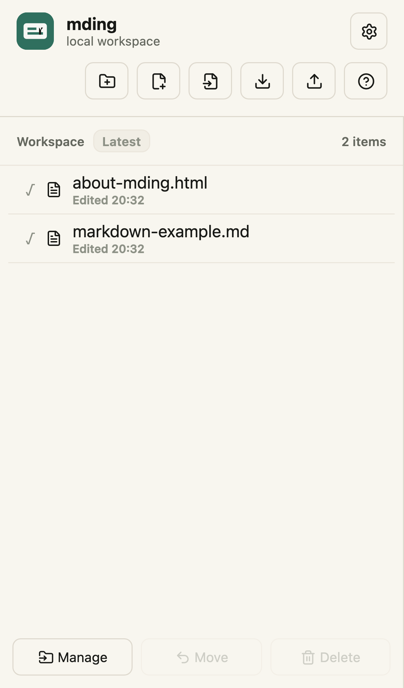
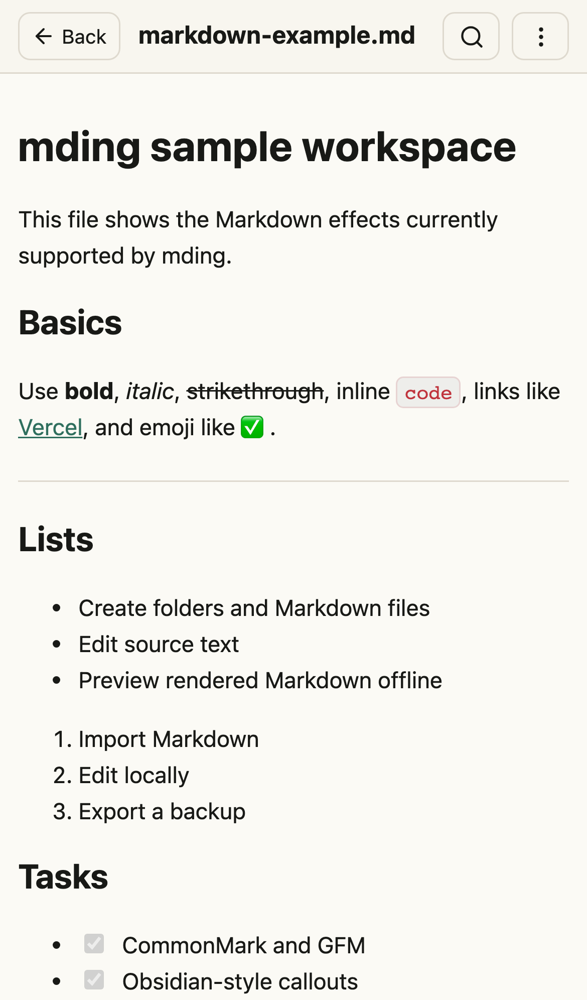
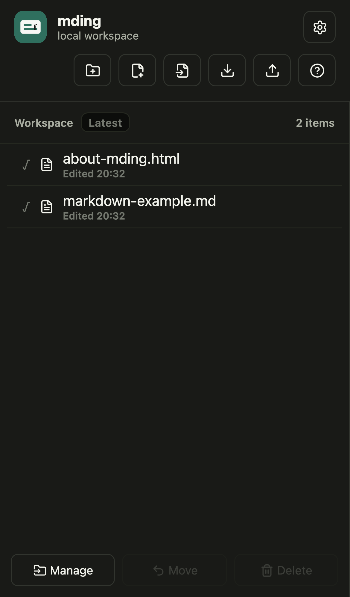
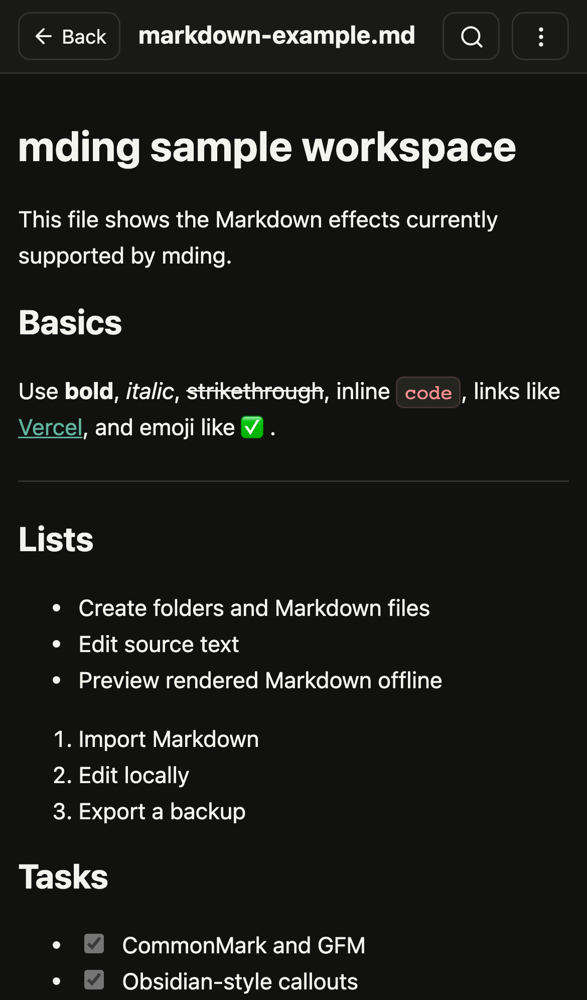
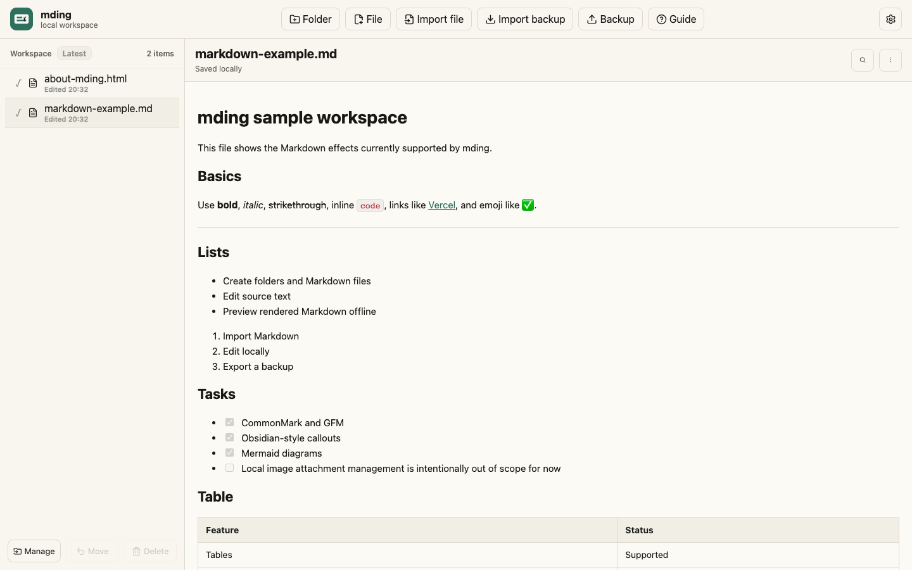
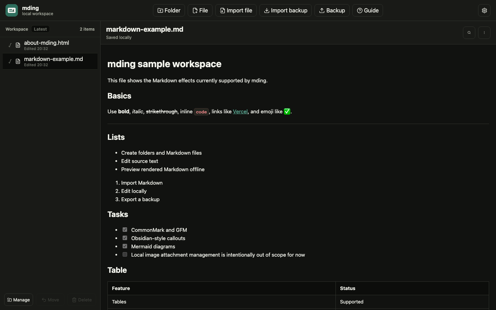

# mding

[English](README.md) | [한국어](README.ko.md)

mding is a lightweight local-first Markdown workspace packaged as a Progressive Web App, with read-only HTML preview support for reference files. It started as a personal iOS/macOS Markdown viewer/editor idea, then moved to a PWA so the same app could run on iPhone, iPad, Mac, and Android without TestFlight, sideloading, or a native app-store release.

The goal is simple: keep a small Markdown workspace on the device, open files quickly, preview them cleanly, edit when needed, and export backups before moving devices or clearing browser data.

## Platform Support

- iOS and iPadOS: install from Safari with Add to Home Screen.
- macOS: install as a Safari web app, or install from Chrome/Edge for the most complete PWA behavior.
- Android: install from Chrome/Edge and other PWA-capable browsers.
- Desktop browsers: usable directly from the hosted URL.

After the first successful online load, the app shell and built assets are cached by the service worker. That includes the Markdown renderer, syntax highlighting chunks, and Mermaid renderer chunks, so Mermaid diagrams continue to render offline after the app has been installed and opened once. External image URLs still need network access unless the image is embedded in the Markdown or already available from browser cache.

## What It Does

- Create, rename, delete, and organize Markdown files and folders in an app-local workspace.
- Pin Markdown files as shortcuts while keeping their original folder location.
- Move files by multi-select or desktop drag and drop, with restore support after deletion.
- Clear the local workspace from Settings after confirmation, with a brief Undo window.
- Preview Markdown, switch to source editing, and save locally.
- Use focused reading for Markdown and HTML previews on desktop and mobile.
- Import `.md`, `.markdown`, `.html`, and `.htm` files into the workspace.
- Export the current document file or the whole workspace backup.
- Run offline after installation through the browser PWA cache.
- Register Markdown and HTML file handling on macOS when installed through Chromium browsers.
- Support English/Korean UI, light mode, dark mode, and compact mobile layouts.
- Use a soft ivory light theme and a compact settings popover for theme/language selection.

## Open Source Status

mding is designed to be open source as a small, personal, local-first PWA rather than a hosted notes service. The code is useful as both an app and a reference implementation for people who want a lightweight Markdown workspace without TestFlight, sideloading, accounts, or a native app-store release.

Project boundaries:

- Local-first by default. No server-side document storage.
- PWA distribution first. Native wrappers are optional future work, not the core product.
- Portable Markdown files and explicit backups matter more than cloud features.
- Trusted read-only HTML preview is supported for personal reference files.

For contribution and maintenance details, see:

- [CONTRIBUTING.md](CONTRIBUTING.md)
- [SECURITY.md](SECURITY.md)
- [CHANGELOG.md](CHANGELOG.md)
- [Open Source Operations](docs/open-source-operations.md)
- [오픈소스 운영 가이드](docs/open-source-operations.ko.md)

## Default Workspace

New local workspaces start with two sample files:

- `markdown-example.md`: a Markdown feature sample with tables, task lists, inline code, callouts, code highlighting, Mermaid, images, and blockquotes.
- `about-mding.html`: a read-only HTML sample that exercises in-frame navigation, local scripts, theme toggling, Mermaid rendering, and preview zoom.

Existing browser workspaces are not renamed automatically. The seed files only apply when mding opens with an empty local workspace.

## HTML Preview

HTML files are preview-only, but they run as normal trusted HTML inside the preview iframe so local controls such as hamburger menus, tabs, and inline scripts can work. Static Mermaid blocks such as `<pre class="mermaid">`, `<div class="mermaid">`, and `<code class="language-mermaid">` are rendered by mding before the iframe loads.

Editing HTML and managing external local asset folders are out of scope for now. Only import HTML you trust, because scripts in the file are allowed to run.

## Markdown Support

mding aims for the practical Notion/Obsidian-style Markdown surface needed for personal notes:

- CommonMark basics: headings, paragraphs, emphasis, bold, blockquotes, horizontal rules, links, and inline code.
- GitHub Flavored Markdown: tables, task lists, autolinks, and strikethrough.
- Lists: unordered, ordered, nested, and task-style checkboxes.
- Code: inline code badges and syntax-highlighted fenced code blocks for common languages.
- Diagrams: fenced `mermaid` blocks with light/dark theme-aware rendering.
- Callouts: Obsidian-style `[!NOTE]`, `[!TIP]`, `[!WARNING]`, `[!DANGER]`, `[!QUOTE]`, and related variants.
- Folded callouts: `> [!NOTE]+` opens by default and `> [!NOTE]-` starts collapsed.
- Images: Markdown image syntax for remote URLs, embedded data URLs, and paths that the browser can resolve. mding does not currently manage local image attachments as separate app assets.
- Emoji: rendered as normal Unicode text.

This is not trying to clone every Notion database or Obsidian plugin feature. It focuses on portable Markdown files plus a few high-value reader effects.

## Storage And Backups

Workspace data is stored in the installed browser app's local IndexedDB:

- iOS/iPadOS Safari home-screen apps use Safari-managed website storage for that installed web app.
- macOS Safari web apps use Safari-managed website storage for that web app.
- macOS Chrome/Edge PWAs use that browser profile's app storage.
- Android PWAs use the installing browser's site/app storage.

This makes editing and reading local documents work offline after installation, but it is still browser-managed storage rather than a user-visible folder. Use the workspace export button for backups, especially before clearing browser data, deleting the installed app, reinstalling the OS, or switching devices.

Current backup flow:

- `Backup` downloads the whole workspace as a zip file.
- The zip contains `manifest.json` for exact app restore plus readable `.md` and `.html` files under `workspace/`.
- `Import backup` restores mding zip backups and older JSON backups into the app-local workspace.
- Individual Markdown and HTML files can still be imported/exported separately.

Future backup options worth considering:

- Reminder-based manual backup prompts after meaningful edits.
- Optional local image attachment management with an `assets/` folder.
- Optional file-system folder sync on browsers that support the File System Access API.

## Deployment Notes

### Data Retention

mding stores workspace files and reading progress in browser-managed storage such as IndexedDB, local storage, and service-worker caches. This is local to the installed app/browser profile and normally survives app restarts and offline use, but it is not the same as a user-owned folder on disk. Browser data can be removed by the user, by clearing site data, by uninstalling the installed web app, or by browser storage policy under storage pressure.

On Apple platforms, the 7-day free-developer sideload limit is a native-app signing issue, not a PWA rule. Safari/WebKit also has a 7-day Intelligent Tracking Prevention cap for some script-writable website storage after no user interaction, but Home Screen web apps' first-party domains are exempt from that specific cap.

For important notes, the safest habit is still explicit backup: use `Backup` to download a zip of the workspace before deleting app data, switching devices, reinstalling the OS, or making large changes.

### If The Hosted Link Goes Away

mding precaches the built HTML, CSS, JavaScript, icons, and renderer chunks through its service worker. After a successful online load, an already installed app can keep opening and working offline as long as the browser keeps those cached assets and local data.

If the hosting URL disappears, new installs will not work, deleted apps cannot be reinstalled from that link, and future update checks cannot fetch a new service worker or new asset bundle. Existing installs may continue to run from cache, but the host should be treated as part of the distribution path.

### Update Trust And Browser Sandbox

PWA updates are web deployments, not app-store-reviewed releases. This project uses automatic service-worker updates, so a newly deployed bundle can be downloaded by installed clients when the browser checks for updates.

That means users should install mding only from a source they trust. A malicious or compromised update would still run inside the browser sandbox, so it should not be able to modify arbitrary system files without browser-granted permissions. However, code running on the app's origin could read, modify, delete, or exfiltrate mding's own local workspace data. Backups protect against accidental data loss, but they do not replace trusting the deployed origin.

## Install And Updates

Deploy the built `dist/` output to a static HTTPS host such as Vercel, Netlify, Cloudflare Pages, or GitHub Pages. Share that HTTPS URL as the install link.

Installation:

1. Open the hosted URL on the target device.
2. iOS/iPadOS: use Safari share sheet, then Add to Home Screen.
3. macOS Safari: use Add to Dock. macOS Chrome/Edge: use the browser app install action.
4. Android: install from Chrome/Edge or another PWA-capable browser.
5. Open the installed app once while online so the app shell and renderer chunks are cached.

Updates:

- A push to the hosting branch is not the same as an immediate installed-app update.
- The host must finish deployment first, then the installed PWA checks the service worker and cached assets.
- Desktop browsers usually update after a hard reload or app restart.
- iOS home-screen PWAs can lag behind; fully quit the app, reopen it, or reboot the device if it keeps showing an older bundle.
- If reinstalling the app, export a workspace backup first because data is browser-managed local storage.

References:

- [MDN: Storage quotas and eviction criteria](https://developer.mozilla.org/en-US/docs/Web/API/Storage_API/Storage_quotas_and_eviction_criteria)
- [MDN: Making PWAs installable](https://developer.mozilla.org/en-US/docs/Web/Progressive_web_apps/Guides/Making_PWAs_installable)
- [MDN: Using service workers](https://developer.mozilla.org/en-US/docs/Web/API/Service_Worker_API/Using_Service_Workers)
- [web.dev: Service worker updates](https://web.dev/learn/pwa/update)
- [web.dev: Persistent storage](https://web.dev/articles/persistent-storage)
- [WebKit: Tracking Prevention](https://webkit.org/tracking-prevention/)
- [Apple Support: Turn a website into an app in Safari on iPhone](https://support.apple.com/guide/iphone/open-as-web-app-iphea86e5236/ios)
- [Apple Support: Use Safari web apps on Mac](https://support.apple.com/en-us/104996)

## Local Development

```sh
corepack pnpm install
corepack pnpm dev
```

Open `http://localhost:5173/`.

## Production Preview

```sh
corepack pnpm build
corepack pnpm serve:pwa
```

Open `http://localhost:4173/`.

This local preview proves the built app shell, manifest, service worker, and static assets are generated correctly. Long-term installation should use an HTTPS static host.

## Verification

```sh
corepack pnpm verify
corepack pnpm serve:pwa
corepack pnpm audit:pwa
corepack pnpm qa:visual
```

`audit:pwa` and `qa:visual` expect the production preview server to be running at `http://127.0.0.1:4173/`.

## License

mding is released under the [MIT License](LICENSE).

## Screenshots

### Mobile Light

<p align="center">
  
  
</p>

### Mobile Dark

<p align="center">
  
  
</p>

### Desktop

<p align="center">
  
  
</p>
