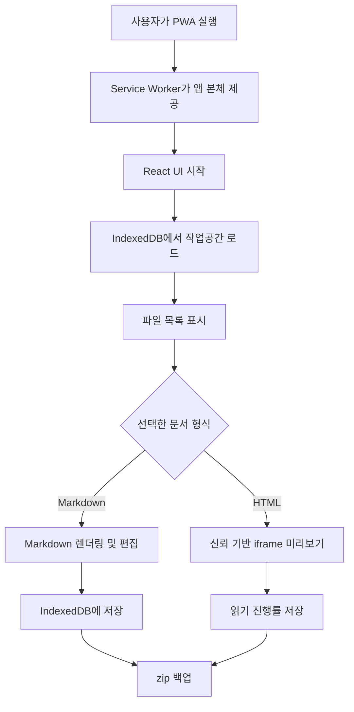
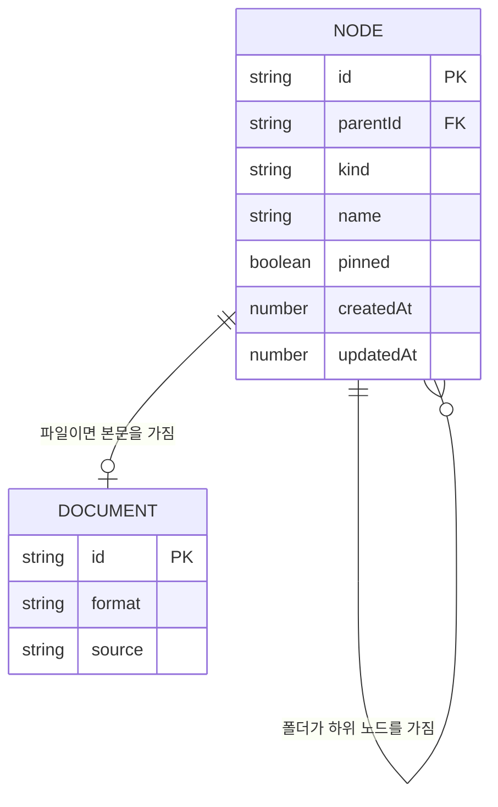
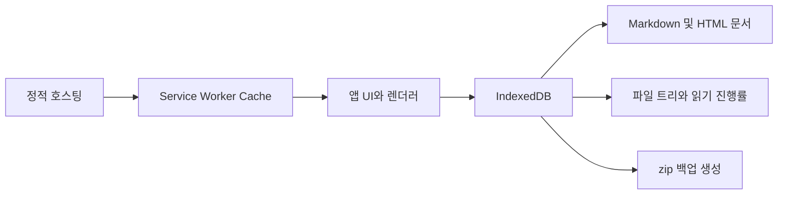
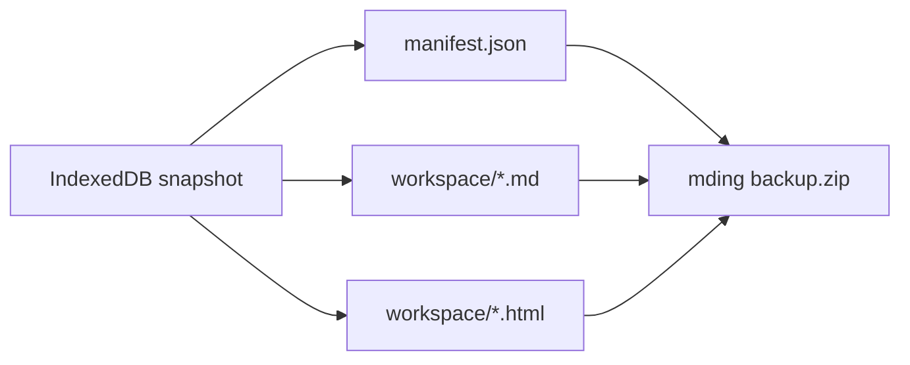
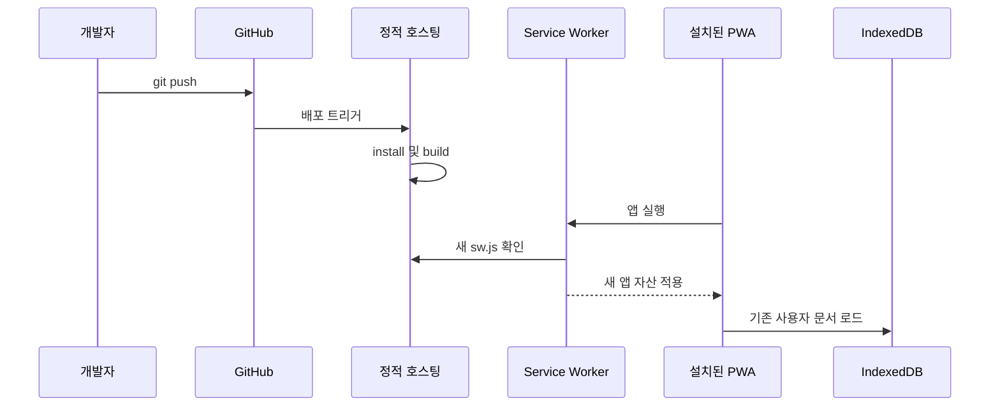
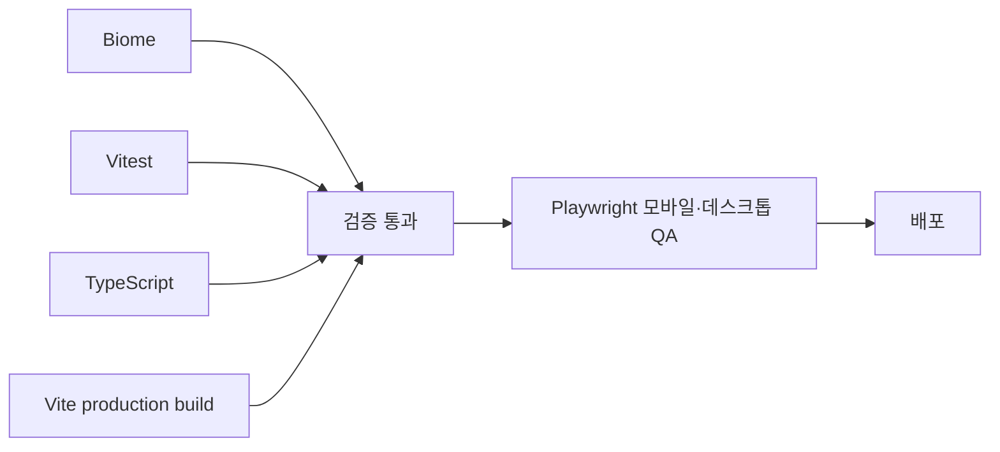

# 네이티브 앱 대신 PWA로 만든 로컬 우선 Markdown 작업공간, mding

> iPhone과 Mac에서 가볍게 Markdown 파일을 읽고 수정하고 싶었다. 계정도, 서버도, 거대한 협업 기능도 필요 없었다. 그렇게 개인 도구로 시작한 `mding`을 PWA로 만들고 오픈소스로 공개하기까지의 과정을 정리했다.


## 시작은 단순한 개인 도구였다

Markdown 문서를 자주 읽지만, 내가 필요로 하는 기능은 생각보다 단순했다.

- 앱 안에서 폴더와 파일을 만든다.
- 파일을 누르면 렌더링된 Markdown으로 읽는다.
- 필요할 때만 원문을 편집한다.
- iPhone과 Mac에서 비슷한 UI로 사용한다.
- 인터넷이 없어도 기존 문서를 읽고 수정한다.

Notion처럼 협업하거나 데이터베이스를 만들 필요는 없었다. Obsidian처럼 거대한 플러그인 생태계를 재현할 생각도 없었다. 작은 작업공간에서 Markdown 파일을 정리하고 읽는 경험만 빠르면 충분했다.

처음에는 SwiftUI로 iOS와 macOS 앱을 만드는 방향을 생각했다. `NavigationSplitView`를 사용하면 Mac에서는 사이드바와 문서를 함께 보여주고, iPhone에서는 화면을 접어 전체 화면 문서로 전환할 수 있었다.

문제는 배포였다. 무료 Apple 개발자 계정으로 직접 설치한 네이티브 앱은 코드 서명을 주기적으로 갱신해야 한다. TestFlight를 사용하면 배포 절차와 빌드 관리가 필요하고, 혼자 오래 사용할 작은 앱에는 이 과정이 상대적으로 크게 느껴졌다.

이미 React와 React Native에 익숙하기도 했다. 여기서 질문이 바뀌었다.

> 네이티브 앱이 꼭 필요한가? 브라우저 저장소와 PWA만으로 내가 원하는 사용 경험을 만들 수 있지 않을까?

## PWA를 선택한 이유

PWA는 웹 기술로 만들지만 홈 화면이나 Dock에 설치할 수 있고, Service Worker를 이용하면 앱 본체를 캐시해 오프라인으로 실행할 수 있다.

한 코드베이스로 다음 환경을 대응할 수 있다는 점이 가장 컸다.

- iOS/iPadOS Safari 홈 화면 앱
- macOS Safari 웹 앱
- macOS Chrome/Edge 설치형 PWA
- Android Chrome/Edge PWA
- 설치하지 않은 일반 데스크톱 브라우저

무료 네이티브 사이드로드의 7일 서명 제한은 PWA에 적용되지 않는다. 앱스토어 심사도 필요 없다. HTTPS 정적 호스팅 주소만 있으면 설치 링크를 공유할 수 있다.

물론 PWA가 네이티브 앱과 완전히 같지는 않다. Finder의 실제 폴더를 자유롭게 다루는 기능, 운영체제 수준 파일 연결, 백그라운드 처리 등은 플랫폼과 브라우저마다 차이가 있다. 그래서 mding은 처음부터 **브라우저 안의 로컬 작업공간**이라는 경계를 받아들였다.

## 제품의 범위를 먼저 제한했다

개인 프로젝트는 기능을 추가하는 것보다 추가하지 않을 기능을 정하는 일이 더 중요했다.

mding이 집중한 범위는 다음과 같다.

| 포함한 기능 | 의도적으로 제외한 기능 |
| --- | --- |
| Markdown 생성·편집·미리보기 | 실시간 협업 |
| 폴더 구성과 다중 이동 | 사용자 계정과 서버 저장 |
| Markdown/HTML 가져오기와 내보내기 | 클라우드 자동 동기화 |
| Mermaid, 코드 하이라이트, 콜아웃 | Notion 데이터베이스 |
| 읽기 진행률과 집중 읽기 | Obsidian 전체 플러그인 호환 |
| zip 전체 백업과 복원 | 로컬 이미지 자산 관리자 |

이미지는 URL이나 data URL로 표시할 수 있지만, 앱 안에서 이미지 폴더까지 관리하지 않는다. 이 기능을 넣으면 백업 포맷, 파일 이동, 경로 변경, 용량 관리까지 함께 설계해야 하기 때문이다.

이 제한 덕분에 앱의 중심을 계속 파일 목록과 읽기 화면에 둘 수 있었다.

## 전체 구조

mding은 React와 TypeScript로 작성하고 Vite로 빌드한다. 사용자 문서는 서버가 아니라 브라우저의 IndexedDB에 저장한다. `vite-plugin-pwa`와 Workbox가 앱 본체를 캐시한다.



기술 스택은 화려하지 않다.

- **React**: 파일 트리, 문서 화면, 설정 UI
- **TypeScript**: 파일·폴더·문서 포맷과 저장 경계
- **Vite**: 정적 앱 번들 및 코드 분할
- **IndexedDB + idb**: 로컬 작업공간 저장
- **React Markdown + remark-gfm**: Markdown 렌더링
- **Mermaid**: 다이어그램 렌더링
- **Shiki**: 코드블록 하이라이트
- **vite-plugin-pwa + Workbox**: 설치, precache, 오프라인 실행
- **Vitest, Biome, Playwright**: 테스트, 검사, 실제 브라우저 QA

## 로컬 우선 저장소를 어떻게 구성했나

작업공간은 크게 노드와 문서로 나뉜다.

- `nodes`: 파일과 폴더의 이름, 종류, 부모 ID, 생성·수정 시간
- `documents`: Markdown 또는 HTML 원문과 문서 형식

폴더 구조는 실제 디스크 폴더가 아니라 `parentId` 관계로 만든 트리다. 덕분에 데스크톱 드래그 앤 드롭과 모바일 다중 선택 이동을 같은 도메인 로직으로 처리할 수 있다.



고정 기능도 파일을 실제로 이동시키지 않는다. 원본의 `parentId`는 그대로 두고 `pinned` 메타데이터만 저장한다. 목록 상단의 `고정됨` 영역은 같은 파일을 가리키는 바로가기다. 고정을 해제해도 원래 폴더를 복원할 필요가 없는 이유다.

## Markdown을 어느 정도까지 지원할 것인가

“Notion이나 Obsidian 정도로 읽기 편했으면 좋겠다”가 렌더러의 기준이었다. 모든 확장 문법을 구현하기보다 실제 문서에서 자주 쓰는 요소를 골랐다.

- CommonMark와 GitHub Flavored Markdown
- 표, 체크박스, 취소선, 중첩 목록
- 인라인 코드와 fenced code block
- 주요 언어 코드 하이라이트
- Mermaid 코드블록
- Obsidian 스타일 콜아웃
- 열림·닫힘 상태를 지정하는 접는 콜아웃
- 링크, 이미지 URL, data URL, 이모지

예를 들어 다음 문법은 접힌 경고 상자로 렌더링된다.

```md
> [!WARNING]- 백업 필요
> 브라우저 데이터를 지우기 전에 작업공간 백업을 내려받으세요.
```

Mermaid는 CDN에서 실행하지 않고 빌드 자산에 포함한다. 처음 온라인으로 앱을 열어 관련 청크가 캐시되면 이후에는 오프라인에서도 다이어그램을 렌더링할 수 있다.

## HTML은 편집하지 않고 읽기만 지원했다

개인적으로 Markdown뿐 아니라 단일 HTML 문서도 자주 읽는다. 그래서 `.html`과 `.htm` 파일은 가져와서 미리볼 수 있게 했다.

HTML 편집까지 지원하면 에디터, asset 경로, CSS·JavaScript 파일 묶음, 폴더 백업 등 범위가 급격히 커진다. mding은 단일 HTML 원문을 읽기 전용 iframe으로 표시하는 선에서 멈췄다.

신뢰한 개인 문서의 햄버거 메뉴, 탭, 테마 버튼이 동작해야 했기 때문에 iframe 내부 script도 실행한다. 이는 편리하지만 명확한 보안 전제가 있다.

> 출처를 신뢰할 수 없는 HTML은 가져오지 않아야 한다.

정적 Mermaid 블록은 iframe을 만들기 전에 SVG로 변환하고, 검색·배율·읽기 진행률은 부모 앱과 iframe 사이의 메시지로 연결한다.

## 오프라인 앱과 사용자 데이터는 서로 다른 곳에 있다

PWA를 만들면서 가장 헷갈리기 쉬웠던 부분은 캐시와 문서 저장소가 다르다는 점이었다.



- **Service Worker Cache**에는 앱을 실행하는 HTML, JavaScript, CSS, 아이콘, 렌더러 청크가 들어간다.
- **IndexedDB**에는 사용자가 만든 파일, 폴더, 문서 원문이 들어간다.
- **다운로드한 zip**은 브라우저 밖에서 사용자가 보관하는 백업이다.

서버가 잠시 내려가도 이미 설치되어 캐시가 남은 앱은 오프라인으로 실행될 수 있다. 하지만 새 설치, 재설치, 업데이트는 불가능해진다. 서버는 사용자의 문서를 보관하는 곳이 아니라 앱 본체를 설치하고 업데이트하는 진입점이다.

## 백업은 선택 기능이 아니라 저장 전략의 일부다

IndexedDB 데이터는 일반적인 사용에서는 유지되지만 사용자가 앱이나 사이트 데이터를 지우거나, 브라우저 프로필을 삭제하거나, 운영체제를 재설치하면 사라질 수 있다. 저장 공간 압박에 따른 브라우저 정책도 완전히 통제할 수 없다.

그래서 mding은 전체 작업공간을 zip으로 내보낸다.



`manifest.json`은 앱이 폴더 구조와 메타데이터를 정확히 복원하기 위한 데이터다. `workspace/` 안의 파일은 mding이 없어도 사람이 직접 열 수 있다. 앱 종속적인 복원성과 일반 파일의 이동성을 함께 확보하려는 구성이다.

기기 간 자동 동기화 대신 백업과 복원을 선택한 것은 불편함을 모른 척한 결과가 아니다. Google Drive나 iCloud 동기화를 넣으려면 인증, 충돌 해결, 삭제 전파, 오프라인 병합, 서비스별 API 변경까지 감당해야 한다. 개인용 경량 앱의 범위를 유지하기 위해 명시적인 파일 이동을 선택했다.

## PWA 업데이트는 어떻게 동작하나

GitHub에 push했다고 설치 앱이 즉시 바뀌는 것은 아니다. 호스팅 서비스가 새 정적 자산을 배포하고, 브라우저가 Service Worker 변경을 확인한 뒤 새 캐시를 활성화해야 한다.



앱 코드가 업데이트되어도 같은 origin의 IndexedDB는 보통 유지된다. 따라서 앱을 삭제하고 다시 설치하는 것이 일반적인 업데이트 절차는 아니다. 특히 iOS에서는 새 Service Worker 반영이 늦을 수 있어 앱을 완전히 종료하고 다시 여는 과정이 필요할 수 있다.

반대로 웹 배포는 앱스토어 심사를 거치지 않는다. 개발자가 잘못된 업데이트를 배포하면 빠르게 사용자에게 전달될 수 있다. 브라우저 샌드박스가 시스템 파일 접근은 제한하지만, 같은 origin에서 실행되는 앱 코드는 IndexedDB 문서를 읽고 수정할 수 있다. 로컬 우선 앱에서도 배포 origin과 업데이트를 신뢰해야 하는 이유다.

## 읽기 경험을 위해 추가한 작은 기능들

개발 과정에서 화려한 기능보다 반복 사용의 불편을 줄이는 기능이 중요했다.

- 문서별 마지막 읽기 위치와 진행률
- 본문 검색과 결과 이동
- 75%~150% 미리보기 배율
- Markdown 편집 모드
- 파일 고정 바로가기
- 집중 읽기 모드
- 라이트·다크·시스템 테마
- 한국어·영어 UI
- 데스크톱 드래그 앤 드롭과 모바일 다중 선택
- 삭제 직후 실행 취소

Mac에서는 사이드바와 문서를 한 화면에 보여주고, 모바일에서는 파일 목록과 상세 화면을 분리했다. 같은 컴포넌트와 상태를 사용하지만 화면 너비에 따라 탐색 방식만 달라진다.

<p align="center">
  
  
</p>

## 기능이 늘면서 생긴 성능 문제

Markdown, Mermaid, 코드 하이라이트, HTML iframe을 함께 사용하면 브라우저 메모리 사용량이 커질 수 있다. 여기서 모든 캐시를 지우는 방식은 선택하지 않았다. 앱을 다시 열 때마다 렌더러를 다시 다운로드하면 오프라인 경험과 로딩 속도가 나빠지기 때문이다.

대신 캐시와 문서별 결과를 분리했다.

- Service Worker의 앱 자산 캐시는 유지한다.
- 한 번 로드한 Mermaid와 Shiki 모듈은 재사용한다.
- 파일을 바꾸면 이전 HTML iframe을 중단하고 빈 문서로 교체한다.
- 이전 Mermaid SVG와 검색 표시를 제거한다.
- 오래된 비동기 렌더링 작업은 취소 신호로 결과 반영을 막는다.
- 여러 Mermaid 다이어그램이 테마 감시자를 각각 만들지 않고 하나를 공유한다.

브라우저 엔진 자체가 사용하는 메모리까지 없앨 수는 없다. 목표는 숫자를 무조건 작게 만드는 것이 아니라 파일을 반복해서 전환할 때 이전 문서 자원이 계속 누적되지 않게 하는 것이었다.

## 테스트는 기능만큼 실제 화면을 확인했다

PWA는 단위 테스트만 통과한다고 끝나지 않았다. 모바일 viewport, iframe 스크롤, Service Worker 캐시, 설치형 레이아웃은 실제 브라우저에서만 드러나는 문제가 많았다.

현재 검증 흐름은 다음과 같다.



특히 다음 시나리오를 반복해서 확인했다.

- Markdown 문법, Mermaid, 코드 하이라이트 렌더링
- HTML iframe 내부 메뉴와 script 실행
- 모바일과 데스크톱 스크롤
- 문서 검색, 배율, 읽기 진행률
- 파일 가져오기와 zip 백업 복원
- 테마 변경과 반응형 레이아웃
- HTML과 Markdown 반복 전환 후 오래된 iframe 정리

## 만들면서 배운 점

### 1. PWA는 단순한 웹 바로가기가 아니다

Manifest, Service Worker, Cache Storage, IndexedDB, 설치 UI, 업데이트 수명 주기를 함께 이해해야 한다. 정적 호스팅만 사용하지만 앱의 상태는 서버·캐시·로컬 데이터로 나뉜다.

### 2. 로컬 우선은 서버가 없다는 말로 끝나지 않는다

데이터를 어디에 저장하고, 누가 소유하며, 어떻게 백업하고, 저장소가 사라졌을 때 무엇을 할지까지 제품에서 설명해야 한다. 백업 버튼과 README의 주의사항도 기능의 일부였다.

### 3. 범위를 제한해야 앱이 가벼워진다

이미지 자산 관리, 클라우드 동기화, HTML 편집은 매력적이지만 각각 새로운 제품에 가까운 복잡도를 만든다. 필요한 기능을 모두 넣는 것보다 앱의 경계를 계속 설명할 수 있는 상태가 중요했다.

### 4. 크로스 플랫폼은 코드 공유만의 문제가 아니다

Mac에서는 넓은 사이드바와 마우스 드래그가 자연스럽지만 iPhone에서는 체크박스 기반 다중 선택과 뒤로 가기 제스처가 필요하다. 같은 데이터 모델 위에 플랫폼별 상호작용을 다르게 얹어야 했다.

### 5. 개인 도구도 오픈소스로 정리하면 품질 기준이 달라진다

README, 라이선스, 보안 정책, 기여 가이드, 변경 로그를 작성하면서 암묵적으로 알고 있던 한계를 명시하게 됐다. 다른 사람이 설치할 수 있는 앱이 되려면 코드뿐 아니라 운영 방식도 설명할 수 있어야 했다.

## 현재의 한계와 다음 단계

mding은 완성된 노트 플랫폼이 아니다. 현재도 다음 한계가 있다.

- 기기 간 자동 동기화가 없다.
- 로컬 이미지 폴더를 앱 자산으로 관리하지 않는다.
- HTML은 신뢰한 파일의 읽기 전용 미리보기만 지원한다.
- 브라우저 저장소 정책에서 완전히 독립적이지 않다.
- 플랫폼마다 PWA 설치와 업데이트 시점이 다르다.

앞으로 기능을 추가한다면 경량성을 해치지 않는 순서로 접근하고 싶다.

1. 백업 시점 안내와 데이터 보존 UX 개선
2. 대용량 문서 렌더링 최적화
3. 브라우저가 지원하는 범위 안에서 선택적 폴더 연결 검토
4. 접근성과 키보드 탐색 개선
5. 실제 사용에서 반복되는 작은 불편 수정

클라우드 동기화는 여전히 매력적이지만, 인증과 충돌 해결까지 책임질 준비가 되었을 때 별도의 기능으로 검토하는 편이 맞다.

## 마무리

mding은 “Markdown 앱을 하나 더 만들자”보다 “내가 실제로 계속 사용할 수 있는 가장 작은 도구는 무엇인가”에서 시작했다.

네이티브 앱을 만들지 않은 것은 기술적 타협이면서 동시에 제품 결정이었다. PWA를 선택하면서 iPhone, iPad, Mac, Android에서 같은 코드를 사용할 수 있었고, 설치와 오프라인 실행도 해결했다. 대신 브라우저 저장소의 한계와 플랫폼별 차이를 받아들이고 백업을 핵심 흐름으로 만들었다.

지금도 가장 중요한 원칙은 처음과 같다.

> 문서를 빠르게 열고, 편하게 읽고, 필요할 때 수정하고, 내 파일로 다시 가져갈 수 있을 것.

프로젝트는 MIT 라이선스로 공개되어 있다.

- GitHub: <https://github.com/jaymunsh/mding-app>
- 기술 개요: [mding PWA 기술 개요](./pwa-technical-overview.md)
- 오픈소스 운영 가이드: [오픈소스 운영 가이드](./open-source-operations.ko.md)
