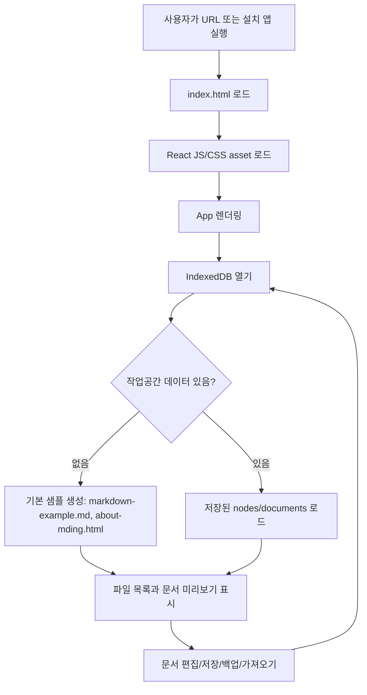
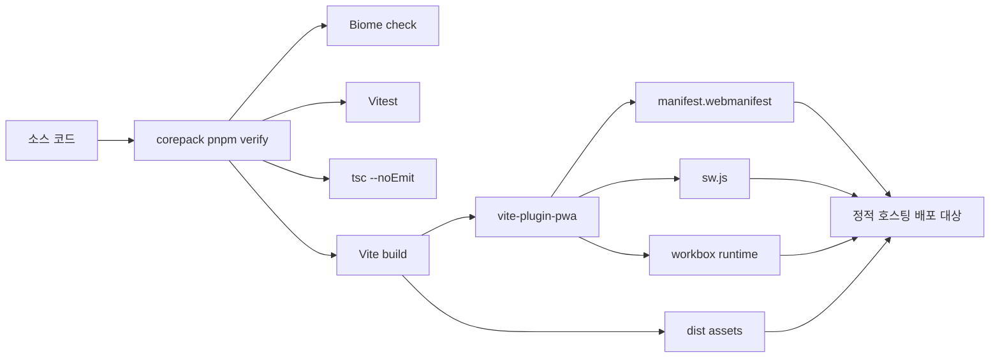
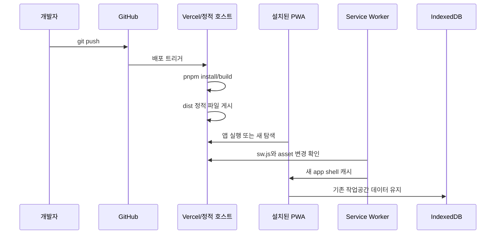
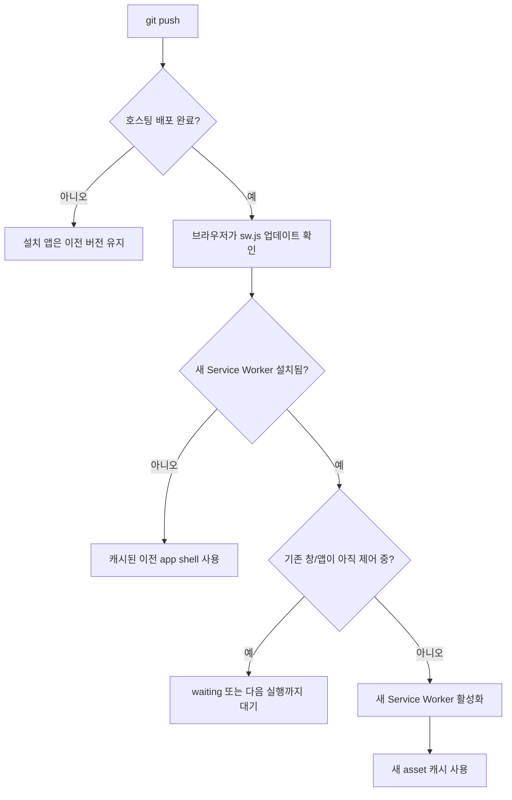
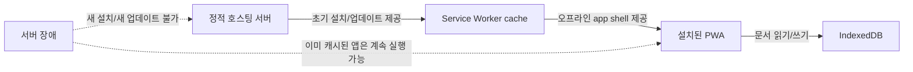
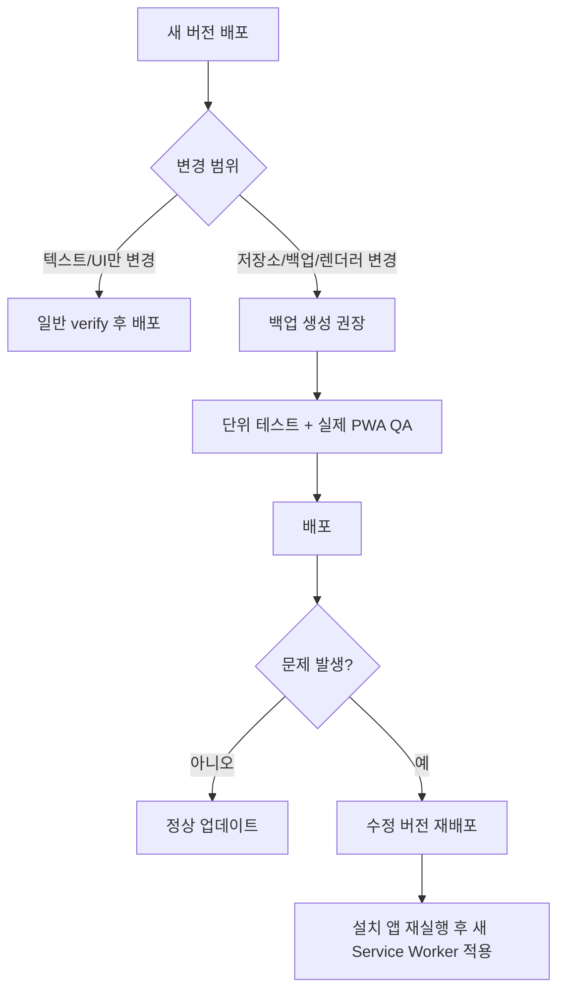
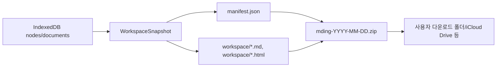

# mding PWA 기술 개요

이 문서는 mding이 단순한 HTML 파일이 아니라 설치형 Progressive Web App으로 동작하는 방식을 정리한다. 기준은 현재 코드베이스의 `vite.config.ts`, `package.json`, `src/storage/*`, `scripts/*` 설정이다.

## 한 줄 요약

mding은 React/TypeScript 앱을 Vite로 정적 파일 묶음으로 빌드하고, `vite-plugin-pwa`가 Web App Manifest와 Workbox 기반 Service Worker를 붙여 설치, 오프라인 캐시, 업데이트 확인을 가능하게 만든다. 사용자 문서는 서버가 아니라 브라우저 로컬 IndexedDB에 저장되며, 백업은 zip 파일로 내보낸다.

## 그냥 HTML과 다른 점

일반적인 `index.html`은 브라우저가 그 HTML을 읽고 끝난다. mding의 배포 결과물도 시작점은 `index.html`이지만, 실제 앱은 여러 기술이 같이 움직인다.

| 구성 요소 | 현재 프로젝트 위치 | 역할 |
| --- | --- | --- |
| HTML entry | `dist/index.html` | 앱 시작점. React 번들과 CSS를 로드한다. |
| React app | `src/main.tsx`, `src/ui/*` | 파일 목록, 편집기, 미리보기, 설정 UI를 렌더링한다. |
| Domain logic | `src/domain/*`, `src/app/*` | 파일 트리, 이동, 선택, 가져오기/내보내기 동작을 처리한다. |
| Local database | `src/storage/database.ts` | IndexedDB `mding-workspace` 데이터베이스를 연다. |
| PWA manifest | `vite.config.ts`의 `manifest` | 앱 이름, 아이콘, 시작 URL, standalone 표시 방식, 파일 핸들러를 선언한다. |
| Service Worker | 빌드 시 `dist/sw.js` 생성 | 앱 shell과 정적 asset을 캐시하고 오프라인 실행을 가능하게 한다. |
| Workbox runtime | 빌드 시 `dist/workbox-*.js` 생성 | precache와 asset 응답 로직을 실행한다. |

그래서 mding은 서버에서 매번 문서를 불러오는 웹사이트가 아니라, 정적 앱 본체를 한 번 받아 설치하고, 작업 데이터는 기기 안 브라우저 저장소에서 읽고 쓰는 local-first 앱에 가깝다.

## 현재 기술 스택

- Vite: TypeScript/React 소스를 `dist/` 정적 asset으로 빌드한다.
- React: 앱 UI와 상태 흐름을 구성한다.
- TypeScript: 도메인 모델과 저장소 경계를 타입으로 관리한다.
- `vite-plugin-pwa`: manifest와 Service Worker 생성을 Vite 빌드에 연결한다.
- Workbox `generateSW`: 직접 Service Worker 파일을 손으로 작성하지 않고 빌드 시 생성한다.
- IndexedDB + `idb`: 브라우저 로컬 데이터베이스에 작업공간을 저장한다.
- Vitest/Biome/Playwright/Lighthouse: 단위 테스트, 정적 검사, 시각 QA, PWA 품질 확인에 사용한다.

## 앱 실행 파이프라인



첫 방문에서는 Service Worker가 아직 현재 페이지를 제어하지 못할 수 있다. 브라우저가 Service Worker를 등록하고 활성화한 다음부터 같은 scope의 요청을 가로채 캐시 응답을 줄 수 있다. 이 때문에 PWA는 “처음 한 번 온라인 로드 후 오프라인 사용”이라는 흐름이 자연스럽다.

## 빌드 파이프라인

현재 로컬 빌드 흐름은 다음과 같다.



`package.json` 기준 주요 명령은 다음과 같다.

| 명령 | 의미 |
| --- | --- |
| `corepack pnpm dev` | Vite 개발 서버를 실행한다. 개발 중에는 빠른 확인용이다. |
| `corepack pnpm build` | 타입 체크 후 프로덕션 `dist/`를 만든다. |
| `corepack pnpm serve:pwa` | 빌드된 `dist/`를 로컬에서 미리보기로 띄운다. |
| `corepack pnpm verify` | Biome, Vitest, TypeScript, Vite build를 한 번에 돌린다. |
| `corepack pnpm audit:pwa` | Lighthouse 기반 품질 점검을 실행한다. |
| `corepack pnpm qa:visual` | Playwright로 모바일/태블릿/데스크톱 화면과 Markdown 렌더링을 확인한다. |

현재 저장소에는 `.github/workflows` 같은 CI 설정이 없다. 그래서 GitHub에 push하는 것만으로 이 저장소 안에서 테스트가 자동 실행되는 구조는 아니다. Vercel 같은 호스팅을 연결하면 “push 감지 -> install/build -> dist 배포” 파이프라인은 호스팅 서비스가 담당한다.

## 배포 파이프라인

Vercel 같은 정적 호스트를 붙였을 때의 흐름은 다음처럼 보는 게 정확하다.



중요한 점은 배포 서버가 사용자의 Markdown 데이터를 갖고 있지 않다는 것이다. 서버는 앱 본체와 업데이트 파일만 제공한다. 문서 데이터는 설치된 앱의 origin별 IndexedDB에 남는다.

## 설치 원리

브라우저가 mding을 설치 가능한 앱처럼 취급하려면 대체로 다음 조건이 맞아야 한다.

- HTTPS 또는 로컬 개발 환경처럼 안전한 context에서 제공된다.
- Web App Manifest가 있다.
- Manifest에 앱 이름, 아이콘, 시작 URL, 표시 방식 같은 정보가 있다.
- Service Worker가 앱 scope 안에서 등록되어 오프라인 또는 캐시 동작을 제공한다.

현재 `vite.config.ts`의 manifest는 다음 성격을 가진다.

- `name`, `short_name`: 설치 UI와 앱 런처에 표시될 이름.
- `display: "standalone"`: 브라우저 탭보다 앱 창에 가까운 표시 방식.
- `start_url: "/"`, `scope: "/"`: 앱 시작 경로와 Service Worker 관리 범위.
- `icons`: 홈 화면, Dock, 런처용 아이콘.
- `file_handlers`: Chromium 기반 설치 PWA에서 `.md`, `.markdown`, `.html`, `.htm` 파일 연결을 시도하기 위한 선언.

iOS/iPadOS Safari의 “홈 화면에 추가”, macOS Safari의 “Dock에 추가”, Chrome/Edge의 “앱 설치”는 모두 이 manifest와 브라우저별 PWA 지원 정책을 바탕으로 동작한다.

## 오프라인 원리

`vite-plugin-pwa`는 현재 설정에서 Workbox `generateSW` 전략을 사용한다. `vite.config.ts`의 `workbox.globPatterns`는 다음 파일들을 precache 대상으로 잡는다.

```ts
["**/*.{js,css,html,svg,png,webmanifest}"]
```

즉 빌드 결과의 JS, CSS, HTML, 이미지, manifest 같은 앱 본체 파일들이 Service Worker 캐시에 들어간다. 사용자가 설치 후 한 번 온라인으로 앱을 열면 다음 실행부터는 네트워크가 없어도 캐시된 app shell을 열 수 있다.

다만 오프라인 범위는 구분해야 한다.

| 항목 | 오프라인 가능 여부 | 이유 |
| --- | --- | --- |
| 앱 UI | 가능 | JS/CSS/HTML이 precache된다. |
| Markdown 렌더러 | 가능 | 앱 번들에 포함된 렌더러 chunk가 캐시된다. |
| Mermaid 렌더러 | 가능 | Mermaid 관련 chunk가 캐시된 뒤에는 오프라인 렌더링 가능하다. |
| 사용자 문서 | 가능 | IndexedDB에 저장된다. |
| 외부 이미지 URL | 조건부 | 네트워크가 없으면 새로 가져올 수 없다. 이미 캐시됐거나 data URL이면 보일 수 있다. |
| 원격 동기화 | 없음 | 현재 앱은 서버 동기화를 하지 않는다. |

## 업데이트 원리

업데이트는 앱 데이터 업데이트와 앱 본체 업데이트를 분리해서 이해해야 한다.

### 앱 본체 업데이트

앱 본체는 `dist/`에 배포된 정적 파일이다. 새 커밋이 배포되면 `index.html`, JS/CSS chunk, `sw.js`, `manifest.webmanifest` 등이 바뀔 수 있다.

브라우저는 Service Worker 파일과 그 의존 파일이 이전과 byte 단위로 달라졌는지 확인한다. 달라졌다면 새 Service Worker를 설치하고, 기존 Service Worker가 제어 중인 창이 정리될 때까지 waiting 상태에 둘 수 있다. 그래서 설치된 앱에서 바로 새 UI가 보이지 않을 수 있다.

현재 설정은 `vite-plugin-pwa`의 `registerType: "autoUpdate"`를 사용한다. 이 설정은 업데이트 발견 시 새 Service Worker 적용을 자동화하는 쪽에 가깝지만, 플랫폼별 캐시 정책과 실행 중인 앱 창 상태 때문에 사용자가 앱을 완전히 종료했다가 다시 열어야 체감되는 경우가 있다.

실무적으로는 다음 순서로 판단하면 된다.



### 사용자 데이터 업데이트

사용자가 편집한 Markdown/HTML 문서는 앱 본체와 다르게 IndexedDB에 저장된다.

- 앱을 업데이트해도 IndexedDB 데이터는 보통 유지된다.
- 앱을 삭제하거나 브라우저 사이트 데이터를 지우면 데이터가 사라질 수 있다.
- 다른 기기에는 자동 동기화되지 않는다.
- 이동과 복구는 `Backup`/`Import backup`이 담당한다.

즉 “앱 업데이트”는 코드와 UI가 바뀌는 것이고, “문서 데이터”는 같은 origin의 로컬 저장소에 남아 계속 읽는 구조다.

### 서버 종료와 설치 앱의 관계

정적 호스팅 서버는 앱을 계속 실행시키는 런타임 서버가 아니라, 앱 본체 파일을 배포하고 업데이트를 제공하는 원본 위치다. 설치된 PWA가 이미 필요한 app shell과 asset을 Service Worker cache에 갖고 있고, 사용자 문서가 IndexedDB에 남아 있다면, 서버가 일시적으로 내려가도 앱이 즉시 사라지지는 않는다.



다만 서버가 장기간 내려가면 다음 작업은 제한된다.

| 상황 | 영향 |
| --- | --- |
| 새 기기에 설치 | 앱 본체를 내려받을 수 없으므로 설치 불가. |
| 기존 설치 앱 실행 | 캐시가 남아 있으면 실행 가능. 캐시가 지워졌으면 복구 불가. |
| 앱 업데이트 | 새 `sw.js`와 새 asset을 받을 수 없으므로 이전 버전 유지. |
| 사용자 문서 | IndexedDB가 유지되는 한 남아 있음. 서버 상태와 직접 연결되지 않는다. |
| 외부 URL 이미지/asset | 네트워크와 외부 서버 상태에 의존한다. |

즉 서버는 “앱의 생명 유지 장치”라기보다 “설치, 재설치, 업데이트, 복구 진입점”이다. 설치 앱 자체와 사용자 문서는 브라우저 저장소에 남지만, 서버가 없어지면 새 app shell을 다시 받을 경로가 사라진다.

### 잘못된 업데이트가 만들 수 있는 문제

앱 본체 업데이트는 사용자 데이터 자체를 서버에서 덮어쓰는 방식이 아니다. 하지만 새 코드가 기존 IndexedDB 데이터를 읽고 쓰기 때문에, 버그 있는 업데이트는 기존 로컬 데이터를 잘못 해석하거나 잘못 저장할 수 있다.

대표적인 위험은 다음과 같다.

| 위험 | 예시 | 완화 방법 |
| --- | --- | --- |
| app shell 로딩 실패 | 새 JS chunk 경로가 맞지 않아 흰 화면이 뜸. | `PreviewRecovery`, 재실행, 빠른 수정 배포. |
| 데이터 스키마 해석 오류 | 이전 `nodes/documents` 구조를 새 코드가 잘못 파싱함. | Zod boundary, 마이그레이션 테스트, 백업 권장. |
| import/export 회귀 | 백업 zip을 만들거나 복원하는 코드가 깨짐. | 백업 관련 단위 테스트와 실제 zip QA. |
| 렌더러 회귀 | Markdown, Mermaid, HTML preview chunk가 깨짐. | 샘플 문서와 Playwright 렌더링 QA. |
| 캐시 전환 타이밍 문제 | 예전 shell이 새 chunk를 찾거나, 새 shell이 예전 cache와 섞임. | 앱 완전 종료 후 재실행, 새 배포로 복구. |

현재 앱은 `registerType: "autoUpdate"`를 사용하므로 업데이트가 발견되면 새 Service Worker 적용을 자동화한다. 이 점은 사용자가 수동으로 “업데이트” 버튼을 누르지 않아도 새 버전을 받기 쉽다는 장점이 있지만, 반대로 잘못된 버전도 자동으로 전파될 수 있다는 뜻이다.

따라서 저장소 구조, 백업 포맷, 문서 format, 파일 가져오기/내보내기, Service Worker 설정을 바꾸는 업데이트는 일반 UI 수정과 다르게 취급해야 한다.



운영 원칙은 단순하다.

- 앱 삭제/재설치를 업데이트 방법으로 쓰지 않는다.
- 중요한 데이터가 있으면 큰 업데이트 전 `Backup` zip을 만든다.
- 문제가 생기면 먼저 서버에 수정 버전을 다시 배포한다.
- 사용자는 설치 앱을 완전히 종료하고 다시 열어 새 Service Worker가 활성화되는지 확인한다.
- 그래도 깨진다면 브라우저 사이트 데이터 삭제나 앱 재설치 전에 반드시 백업 가능 여부를 먼저 확인한다.

## 저장소 원리

현재 IndexedDB 구조는 `src/storage/database.ts`에 정의되어 있다.

| Object store | Key | 내용 |
| --- | --- | --- |
| `nodes` | `id` | 파일/폴더 트리 노드. `parentId`, `kind`, `name`, `createdAt`, `updatedAt` 포함. |
| `documents` | `id` | 파일 본문. Markdown 또는 HTML 문자열과 format 정보 포함. |

초기 실행 시 `src/storage/workspaceRepository.ts`의 `seedIfEmpty()`가 `nodes` 개수를 확인한다. 비어 있으면 다음 샘플을 생성한다.

- `markdown-example.md`
- `about-mding.html`

이미 데이터가 있는 작업공간은 seed를 다시 실행하지 않는다. 그래서 기존 사용자의 파일명을 자동으로 바꾸지 않는다.

## 백업 원리

백업은 서버 업로드가 아니라 브라우저에서 로컬 파일로 다운로드하는 방식이다.



`Backup`은 전체 작업공간을 zip으로 만든다.

- `manifest.json`: 앱이 정확히 복원하기 위한 원본 snapshot.
- `workspace/`: 사람이 직접 열어볼 수 있는 `.md`, `.html` 파일.

`Import backup`은 mding zip 백업과 이전 JSON 백업을 읽어서 IndexedDB의 `nodes`, `documents`를 교체한다.

## HTML 미리보기 원리

HTML 파일은 편집 대상이 아니라 읽기 전용 미리보기 대상이다. 앱은 HTML 문자열을 preview iframe에 넣어 보여준다. 현재 방향은 개인이 신뢰하는 단일 HTML 파일을 가져와 읽는 용도이므로, 내부 버튼과 inline script가 동작하도록 열어둔 상태다.

다만 이것은 보안 모델상 중요한 전제다.

- 신뢰할 수 없는 HTML을 가져오면 그 HTML 안의 script도 실행될 수 있다.
- 외부 asset, 외부 API 호출, 외부 이미지 로딩은 네트워크와 해당 HTML 코드에 영향을 받는다.
- mding은 HTML 편집기나 asset 폴더 관리자까지는 제공하지 않는다.

## Markdown 렌더링 원리

Markdown 파일은 저장소에는 원문 문자열로 저장되고, 화면에서는 React 렌더러가 HTML 구조로 변환해 보여준다.

현재 지원 축은 다음과 같다.

- CommonMark/GFM 계열 Markdown.
- 표, 체크박스, 취소선.
- 인라인 코드와 fenced code block.
- Shiki 기반 코드 하이라이트.
- Mermaid code block.
- Obsidian 스타일 callout과 접는 callout.
- 이미지 URL 또는 data URL.

원문은 Markdown 그대로 유지되므로, 백업 zip 안의 `.md` 파일은 다른 Markdown 도구에서도 열 수 있다.

## 파일 핸들링과 플랫폼 차이

manifest의 `file_handlers`는 Chromium 기반 설치 PWA에서 Finder/파일 관리자와 앱 연결을 시도하기 위한 선언이다. 하지만 모든 브라우저와 OS가 같은 수준으로 지원하지 않는다.

현실적인 기준은 다음과 같다.

| 플랫폼 | 기대 동작 |
| --- | --- |
| iOS/iPadOS Safari PWA | 홈 화면 앱 실행과 로컬 저장은 가능. Finder식 파일 핸들링은 기대하기 어렵다. |
| macOS Safari Web App | Dock 앱처럼 실행 가능. Chromium 수준 파일 핸들링은 제한적이다. |
| macOS Chrome/Edge PWA | manifest file handlers 지원 범위 안에서 `.md`, `.html` 연결 가능성이 가장 높다. |
| Android Chrome/Edge PWA | 설치와 오프라인 실행은 가능. 파일 연결 UX는 브라우저/OS 버전에 따라 다르다. |

그래서 mding의 안정적인 파일 이동 방법은 여전히 앱 내부 `Import file`, `Import backup`, `Backup`이다.

## 캐시와 데이터의 경계

PWA에서 헷갈리기 쉬운 부분은 “캐시”와 “문서 저장소”가 다르다는 점이다.

| 영역 | 저장 위치 | 지워졌을 때 영향 |
| --- | --- | --- |
| Service Worker cache | 브라우저 Cache Storage | 앱 shell 오프라인 실행이 깨질 수 있다. 다시 온라인 접속하면 회복 가능하다. |
| IndexedDB | 브라우저 IndexedDB | 사용자 문서가 사라질 수 있다. 백업 없이는 복구하기 어렵다. |
| 브라우저 HTTP cache | 브라우저 내부 캐시 | asset 재다운로드가 늘 수 있다. 보통 치명적이지 않다. |
| 다운로드한 zip 백업 | 사용자가 저장한 파일 위치 | 앱 밖에 있으므로 앱 삭제와 별개로 남는다. |

앱을 업데이트하기 위해 앱을 삭제했다가 다시 설치하는 것은 마지막 수단이다. 그 전에 반드시 `Backup`을 내려받아야 한다.

## 현재 권장 운영 방식

1. 기능을 수정한다.
2. `corepack pnpm verify`를 실행한다.
3. 필요하면 `corepack pnpm serve:pwa`와 `corepack pnpm qa:visual`로 실제 브라우저 동작을 확인한다.
4. 커밋하고 GitHub에 push한다.
5. Vercel 같은 정적 호스트가 새 배포를 완료하는지 확인한다.
6. 설치된 PWA를 재실행하거나 하드 리로드한다.
7. iOS 홈 화면 앱이 오래된 번들을 계속 보이면 앱 완전 종료, 재실행, 필요 시 기기 재부팅 순서로 확인한다.
8. 앱 삭제/재설치 전에는 `Backup`을 먼저 만든다.

## 현재 한계

- 서버 동기화가 없다. 기기간 이동은 백업 파일로 한다.
- 로컬 이미지 asset 폴더를 앱 내부에서 별도로 관리하지 않는다.
- iOS의 PWA 업데이트 반영 시점은 브라우저/OS 정책 영향을 받는다.
- CI/CD 설정 파일은 아직 저장소에 없다. 자동 빌드와 자동 검증은 호스팅 서비스 설정 또는 GitHub Actions 추가가 필요하다.
- HTML 미리보기는 신뢰한 파일을 전제로 script 실행을 허용한다.

## 참고 자료

- [MDN: Progressive web apps](https://developer.mozilla.org/en-US/docs/Web/Progressive_web_apps)
- [web.dev: Service workers](https://web.dev/learn/pwa/service-workers)
- [web.dev: Update](https://web.dev/learn/pwa/update)
- [Vite PWA: Workbox](https://vite-pwa-org.netlify.app/workbox/)
- [MDN: IndexedDB API](https://developer.mozilla.org/en-US/docs/Web/API/IndexedDB_API)
